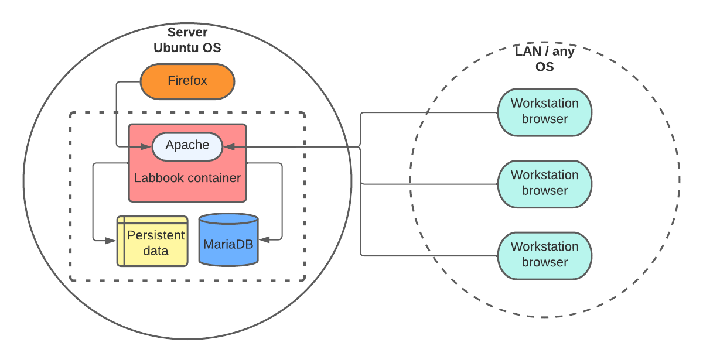

# Architecture

## Introduction

LabBook as provided by Fondation Mérieux is packaged as an ISO.
When you install this ISO on a dedicated physical or virtual machine, you get an Ubuntu system with LabBook.

An update package is also available.

All downloads are available [from this page](https://www.lab-book.org/en/downloads/).

LabBook is a web application, clients use it through a browser inside the LAN.
For safety and legal reasons, LabBook is NOT designed to be used over the internet.

This document describes the software architecture of the standard LabBook installation.
You may find complementary information about running LabBook in a development environment or in non standard setups in the [README](../README.md) of this project.

As detailed below, LabBook runs inside a container, to remain independant from the base Ubuntu system as much as possible.

Here is a general schema of the production architecture:

## Base system and database

Ubuntu was chosen for several reasons, mainly:

- it is well adapted to low budget installations,
- it is reasonably user-friendly and has a large library of available applications,
- it is comparitively safer than the main alternative.

LabBook stores structured data in a MySQL/MariaDB database and reports and imported information in files.
The database server runs and stores its data on the base host.
Individual files are also stored on the base host in a volume accessible from the application container.

## Application container

LabBook runs in a Podman container, it connects to the database through a network connection to the base host, and accesses data files in a volume.

The container is based on [Almalinux](https://almalinux.org/) which includes software components used by LabBook:

- the Apache web server
- python 3

Additionnal packages installed in the container include:

- [Supervisor](http://supervisord.org) to control the various daemons, mainly Apache and the 2 [Gunicorn](https://gunicorn.org/) instances that run the python applications labbook_FE (front end) and labbook_BE (back end)
- [Unoconv](http://dag.wiee.rs/home-made/unoconv/) to convert OpenDocument files to PDF

To see the full details of the creation of the LabBook container you can refer to the [Dockerfile](../Dockerfile) at the root of this project.

## Python applications

The LabBook application is structured as two separate python applications:

- labbook_FE manages the front end,
- labbook_BE exposes backend data through a REST API.

They both use the [Flask](https://en.wikipedia.org/wiki/Flask_(web_framework)) framework.
